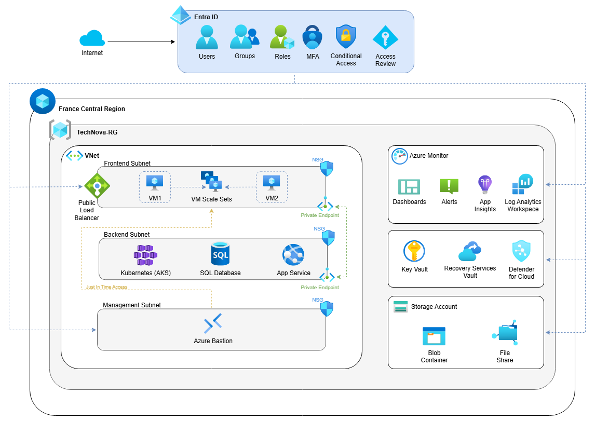

# TechNova Solutions - Azure Cloud migracija

Dobrodošli u repozitorij projekta za modernizaciju IT infrastrukture tvrtke TechNova Solutions.
Ovo rješenje demonstrira implementaciju Infrastructure as Code (IaC) principa koristeći Azure Bicep i PowerShell za potpunu automatizaciju cloud okoline na Microsoft Azure platformi.

Projekt je izrađen u sklopu kolegija "Implementacija računarstva u oblaku" na Sveučilištu Algebra Bernays.

---

## Arhitektura rješenja

Rješenje je dizajnirano prema Microsoft Well-Architected Framework principima, s naglaskom na sigurnost, automatizaciju i skalabilnost.



### Ključne komponente

| Komponenta | Tehnologija | Opis |
| :--- | :--- | :--- |
| **Identiteti (IAM)** | **Microsoft Entra ID** | Grupe (Dev, Sales, Support), MFA i **Conditional Access** (blokada po lokaciji - HR). |
| **Compute (Web)** | **VM Scale Set** | Ubuntu VM-ovi s **Autoscalingom** (CPU > 75%) iza Load Balancera. |
| **App Service (PaaS)** | **Azure Web App** | Interna web aplikacija s podrškom za **Autoscaling** i visoku dostupnost. |
| **Containeri** | **Azure Kubernetes (AKS)** | **Demonstracijski resurs:** Potpuno provizioniran k8s klaster. |
| **Baza Podataka** | **Azure SQL Database** | **Demonstracijski resurs:** PaaS baza za strukturne podatke (Backend). |
| **Pohrana** | **Storage & Key Vault** | **File Share** za dijeljene datoteke, Lifecycle Management, **Key Vault** za tajne. |
| **Sigurnost (JIT)** | **NSG & JIT** | Simulirani **Just-In-Time (JIT)** pristup administrativnim portovima (SSH). |
| **Nadzor** | **Monitor & Dashboard** | Centralizirani dashboard, logovi i **Action Groups** za alarme. |
| **Automatizacija** | **Bicep & PowerShell** | Potpuni One-Click Deploy i Destroy procesi. |

*Napomena: Resursi označeni kao "Demonstracijski" su u potpunosti provizionirani i konfigurirani na razini infrastrukture kako bi se prikazala arhitekturalna cjelovitost rješenja, iako ih osnovna web aplikacija u ovoj fazi PoC-a (Proof of Concept) ne koristi aktivno.*

---

## Preduvjeti

Prije početka, osigurajte da na svom računalu imate instalirane sljedeće alate i module.

### 1. Instalacija alata i modula
*   **Visual Studio Code**: Preporučeni editor (uz "Bicep" ekstenziju).
*   **PowerShell 7+**: Preporučena verzija terminala.
*   **Azure CLI**: Alat za upravljanje Azure resursima.
*   **PowerShell Moduli**:
    *   `Az` (Azure PowerShell moduli)
    *   `Microsoft.Graph` (Microsoft Graph API SDK)

### 2. Provjera i instalacija preduvjeta
Otvorite terminal (PowerShell) i pokrenite sljedeće naredbe:
```powershell
# Instalacija potrebnih modula (ako već nisu instalirani)
Install-Module -Name Az -Scope CurrentUser -Repository PSGallery -Force
Install-Module -Name Microsoft.Graph -Scope CurrentUser -Repository PSGallery -Force

# Provjera verzija
az --version
$PSVersionTable
```

---

## Upute za pokretanje

### Korak 1: Preuzimanje repozitorija
Klonirajte ovaj javni repozitorij na svoje lokalno računalo. Za ovaj korak nije potrebna prijava:
```powershell
git clone https://github.com/krebor/technova-solutions.git
cd technova-solutions
```

### Korak 2: Pokretanje deploymenta
Ovo rješenje koristi Smart Login sustav koji provjerava postojeće sesije i pamti konfiguraciju.

1.  Pokrenite glavnu skriptu:
    ```powershell
    ./deploy.ps1
    ```

2.  **Prvo pokretanje:** Skripta će tražiti unos **Tenant ID**-a.
    *   Unesite domenu ili GUID vašeg tenanta (npr. `ime.prezime.onmicrosoft.com`).
    *   Podatak će biti spremljen lokalno te ga kod idućih pokretanja nećete morati ponovno unositi.

3.  **Proces:**
    *   Skripta provodi autentikaciju na Azure i Microsoft Graph servisima.
    *   Automatizirano se kreiraju korisnici i grupe u Entra ID-u.
    *   Inicira se Bicep deployment (predviđeno trajanje: 10-15 minuta).

4.  **Završetak:**
    *   Deployment je uspješan kada se u terminalu pojavi poruka: `>>> DEPLOYMENT USPJEŠNO ZAVRŠEN! <<<`.

---

## Verifikacija rješenja

### 1. Web aplikacija
Pristupite aplikaciji putem javne IP adrese Load Balancera (ispisana u terminalu ili vidljiva na Portalu pod `technova-lb-pip`):
`http://<IP-ADRESA>`

### 2. Azure Portal
Provjerite Resource Grupu **TechNova-RG**. Svi resursi moraju biti u stanju "Succeeded".

### 3. Entra ID
Provjerite jesu li u Microsoft Entra ID servisu kreirane grupe `TechNova-Dev`, `TechNova-Sales` i `TechNova-Support` s pripadajućim korisnicima.

### 4. Napredne značajke
Kako biste potvrdili ispunjenje svih ishoda učenja, provjerite sljedeće:
*   **App Service:** Pronađite App Service resurs (prefix `technova-internal...`) i otvorite URL aplikacije.
*   **Autoscaling:** Unutar App Service Plana (ili VMSS-a) navigirajte na **Settings -> Scale out**. Provjerite definirana pravila (npr. *Increase count by 1 when CPU > 80%*).
*   **Key Vault:** Otvorite Key Vault resurs, odaberite **Objects -> Secrets**. Provjerite jesu li `VmAdminPassword` i `SqlAdminPassword` uspješno pohranjeni.
*   **Storage Lifecycle:** Otvorite Storage Account, pod **Data management** odaberite **Lifecycle management**. Provjerite postoji li pravilo `MoveToCoolTier`.
*   **Monitoring Dashboard:** Potražite resurs tipa "Dashboard" u resource grupi za vizualni pregled metrika.

---

## Sigurnosne napomene

Zbog ograničenja studentskih pretplata koje često ne uključuju "Microsoft Defender for Cloud - Server Plan", **Just-In-Time (JIT) VM Access** je implementiran kao **arhitekturalni simulirani model**:
*   Administrativni portovi (SSH 22) su po defaultu postavljeni na **Deny** u `Management` subnetu.
*   Pravilo sadrži opis o JIT simulaciji. 
*   Pristup se u stvarnom scenariju otvara putem Azure API-ja (JIT Request) koji privremeno mijenja NSG pravilo.

---

## Čišćenje

Kako biste spriječili nepotrebne troškove i oslobodili kvote na studentskoj pretplati, nakon testiranja uklonite resurse.

Pokrenite skriptu:
```powershell
./destroy.ps1
```
Ova skripta sinkrono briše cijelu Resource Grupu, sve Entra ID identitete te vrši **Purge** (trajno brisanje) Key Vaulta radi sprečavanja konflikata kod idućeg deploymenta.

---

## Struktura projekta

```text
.
├── deploy.ps1                 # Glavna skripta za deployment
├── destroy.ps1                # Skripta za brisanje okoline
├── README.md                  # Dokumentacija rješenja
├── dokument.txt               # Sadržaj za finalnu PDF dokumentaciju
├── azure-deploy/              # Bicep Infrastructure-as-Code
│   ├── main.bicep             # Glavna orkestracija resursa
│   └── modules/               # Modularne Bicep komponente
│       ├── appservice.bicep   # PaaS Web App + Autoscale
│       ├── keyvault.bicep     # Sigurno upravljanje tajnama
│       ├── dashboard.bicep    # Vizualni monitoring dashboard
│       ├── compute.bicep      # VMSS (IaaS) + Autoscale
│       └── ...                # Ostali moduli (Network, SQL, AKS...)
└── scripts/                   # PowerShell pomoćne skripte
```

---

**Autor:** Krešimir Borbaš  
**Institucija:** Sveučilište Algebra Bernays 
**Godina:** 2025.